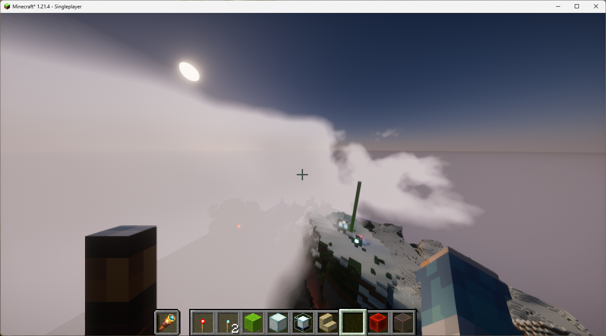
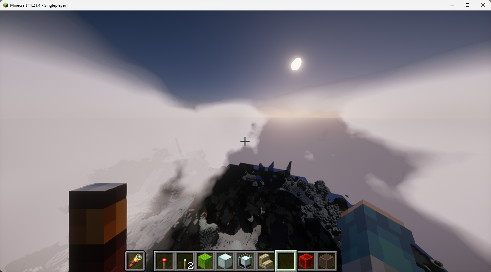
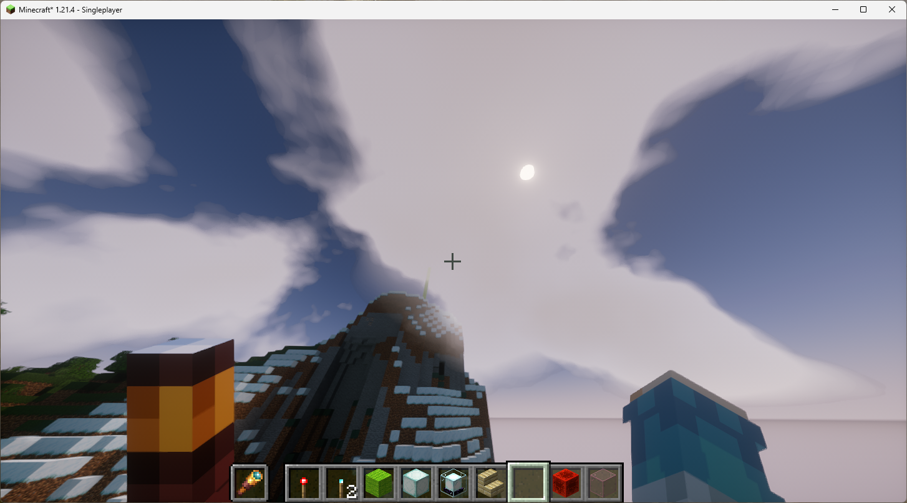
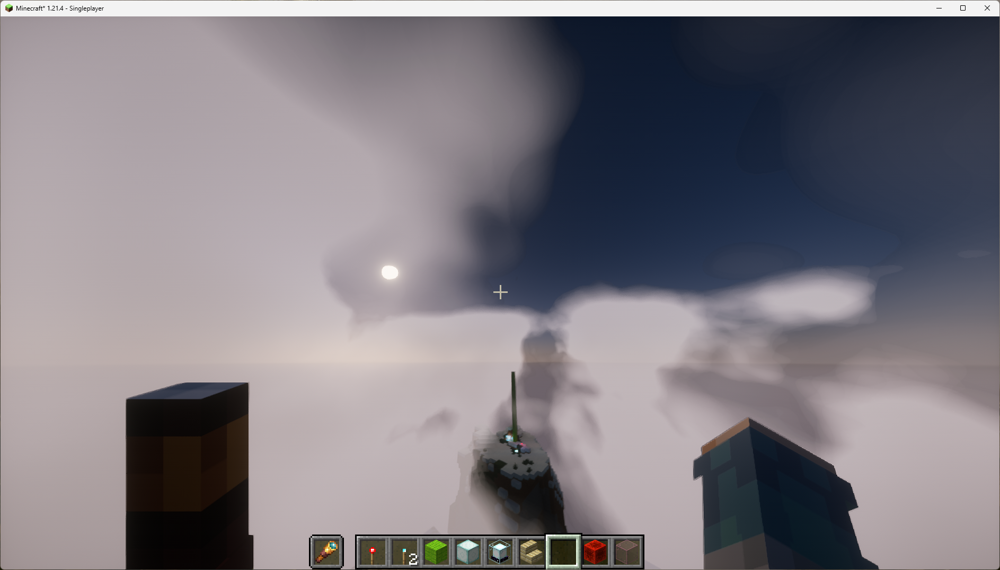
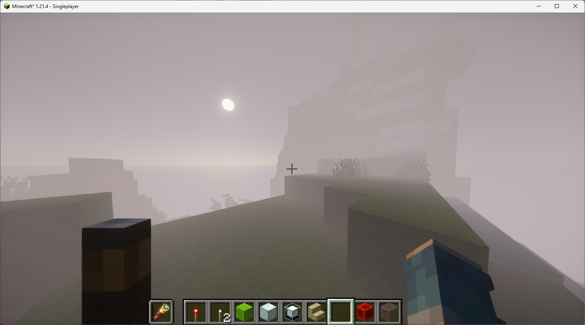
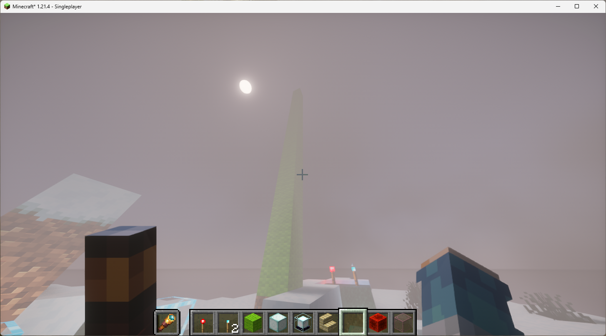
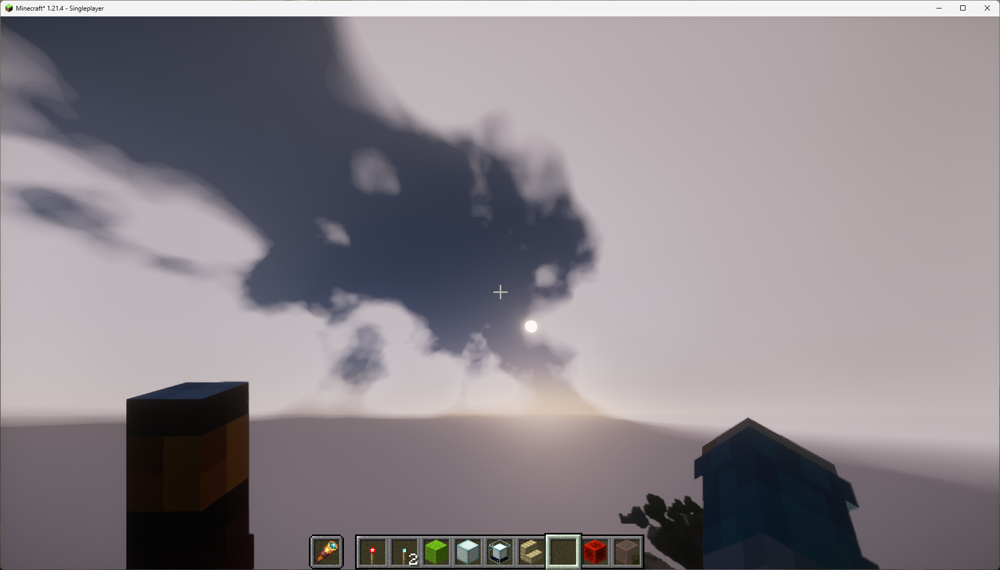
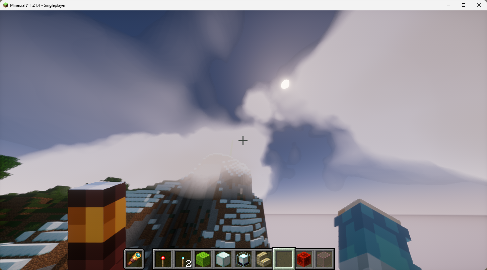
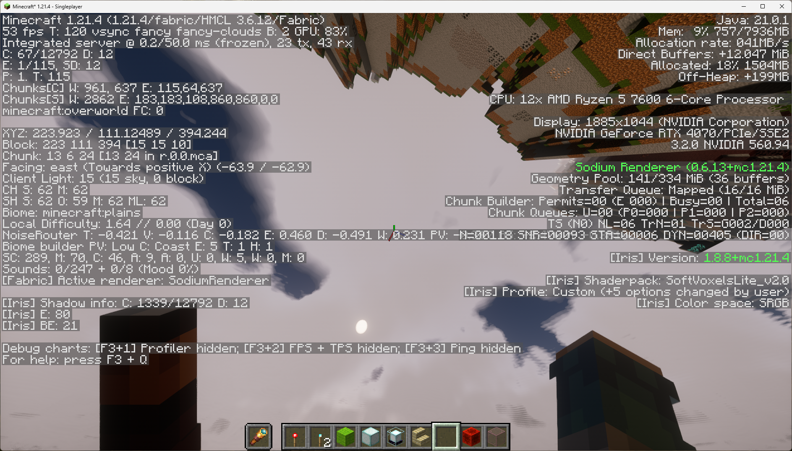

# **基于Minecraft的实时体积云实现分析报告**

## 摘要

本报告详细介绍了一项在类 Minecraft 风格的渲染引擎中，通过修改和实现自定义着色器（Shader）来实时渲染体积云的实验。实验的核心是采用基于光线步进（Ray Marching）的渲染管线，并结合程序化生成的分形布朗运动（FBM）噪声来构建动态、逼真的云层。报告将阐述实验的具体步骤、实现过程中遇到的挑战、核心算法的详细代码实现思路，并对该算法的优缺点及未来改进方向进行深入探讨。

**开源代码:** [TODO: 在此插入代码仓库URL]

## 1. 实验步骤与遇到的问题

### 1.1 实验步骤

本项目旨在不依赖预计算纹理或静态模型，完全通过着色器在GPU上实时生成和渲染动态的体积云。整体实现流程可分为以下几个关键步骤：

**基础框架搭建**: 
 在现有的Minecraft渲染管线中，确定渲染天空和远景的着色器作为修改对象。设置一个独立的渲染通道（Pass）用于绘制体积云，确保它能与场景中的其他物体（如地形）进行正确的深度遮挡测试。

**噪声模型实现**:
实现了高质量的 `simplexNoise` 函数，作为生成所有程序化形状的基础。然后基于Simplex噪声，构建了分形布朗运动（`fbm`）函数。通过在不同频率和振幅上叠加多层噪声，`fbm` 能够生成具有自相似性和丰富细节的、外观自然的噪声图，以模拟云的复杂结构。、

利用两层FBM噪声：一层低频的 `base_noise` 用于勾勒云块的基本形状和轮廓，另一层高频的 `detail_noise` 从基础噪声中减去，用于雕刻出云层边缘的细节和空洞，增强真实感。

**raymarch核心渲染算法**:
实现了光线步进（Ray Marching）作为核心渲染算法。对于屏幕上的每一个像素，从视点（摄像机位置）沿着视线方向发射一条射线。计算该射线与云层高度范围的入口点（`tmin`）和出口点（`tmax`）。在 `[tmin, tmax]` 区间内，沿着射线方向进行迭代步进。在每一步中，对当前位置的云密度进行采样。

**自阴影计算**

为了模拟云自身的厚度带来的明暗变化，我们实现了二次光线步进。在主光线步进的每一步，从当前采样点再向太阳方向进行一次简短的光线步进，计算光线穿过云层后的能量衰减（透光率），从而得到该点的光照强度。
**相位函数**

实现了Henyey-Greenstein相位函数，用于模拟光在云介质中的散射方向。通过调整参数 `g`，我们同时模拟：
    1. 前向散射 (g > 0)：光线主要沿着原方向散射，这会在云的边缘（当太阳在云后方时）产生明亮的银边效果。
    2. 后向散射 (g < 0)：光线向光源方向散射，用于为云的暗部提供微弱的补光，增加体积感。

**颜色与透明度累积**: 在主光线步进循环中，采用从后向前（back-to-front）的混合策略。每一步计算出的光照颜色会乘以当前视线方向的透光率，然后累加到最终颜色上。同时，根据当前步的密度，衰减视线方向的透光率，为下一步计算做准备。最终的Alpha值基于物理上的光学深度计算得出，实现了更真实的透明度效果。

**性能调优与参数调整**:
反复调整FBM的参数（层数、频率、增益）以获得美观的云朵形态。

平衡主光线步进和光照步进的步数与步长，在保证视觉效果没有明显瑕疵（如条纹状伪影）的前提下，尽可能提高渲染帧率。最终在RTX 4070上于1080p分辨率下达到了50-60 FPS的流畅性能。

### 1.2 遇到的问题和困难

主要困难：实现高质量且“像云”的噪声形态。

在项目初期，实现一个基础的、有体积感的云雾效果相对直接，但要让它看起来像真实的云，而不是一团模糊的噪声，则极具挑战性。FBM函数本身以及 `cloudDensity` 函数中的组合方式引入了大量参数（FBM的octaves, lacunarity, gain，两层噪声的缩放比例和混合权重，垂直梯度的平滑范围等）。这些参数之间相互影响，微小的改动都可能导致最终形态的巨大差异。例如，细节噪声权重过高会导致云体过于破碎，而过低则显得平淡无奇。我们经过了大量的、反复的测试和迭代，才最终确定了当前代码中这组能产生动态、美观且形态多样的云层的参数。

另外光线步进的步数是影响渲染质量和性能最直接的因素。步数太少，会导致云层出现明显的条纹或“切片”感；步数太多，则会严重拖累帧率。尤其是在计算自阴影的二次光线步进中，每一步都需要额外开销。我们通过引入随距离自适应增大的步长（`dt = max(0.1, 0.04*t/float(kDiv))`）来作为一种优化，即近处的云细节多，步长小，远处的云细节少，步长大，以此在视觉效果和性能之间取得了较好的平衡。

## 2. 结果图

## 3. 算法评估

### 3.1 优点

**高性能与高画质**
本实现能够在RTX 4070上以1080p分辨率达到50-60 FPS的流畅帧率，同时提供了包括自阴影、银边效应在内的高质量视觉效果，达到了实时渲染的要求。

**动态效果**
完全依赖程序化噪声生成，云层可以实现永不重复、持续演变的动态效果，渲染云的丰富流动感。
**正确的场景交互与体积渲染**
作为真正的实时体积渲染，该云层具备三维实体的所有特性。可以飞入云中，体验能见度降低、光线被遮蔽的雾气效果；云层也能与游戏世界中的高山等物体正确地进行前后遮挡。

### 3.2 缺点

固定的步进次数和步进策略是一种近似。在特定角度或距离观察时，可能仍然存在纹状的瑕疵。

### 3.3 改进空间

**性能优化**:
当前的线性步进即使在云密度很低的区域也会执行。可以引入更智能的步进策略，例如使用一个低分辨率的密度网格来指导光线，使其可以安全地“跳过”大片完全透明的区域，从而显著减少不必要的采样。

**视觉质量提升**
实现随机算法减少条纹出现
体积光渲染